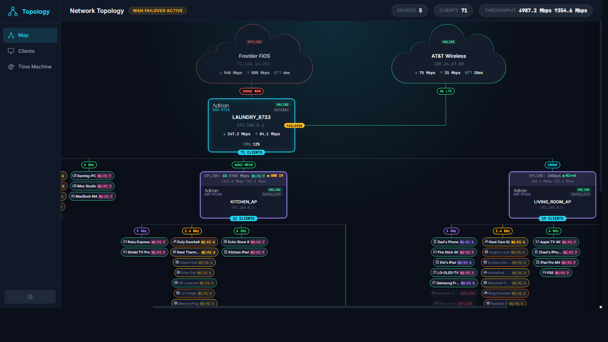
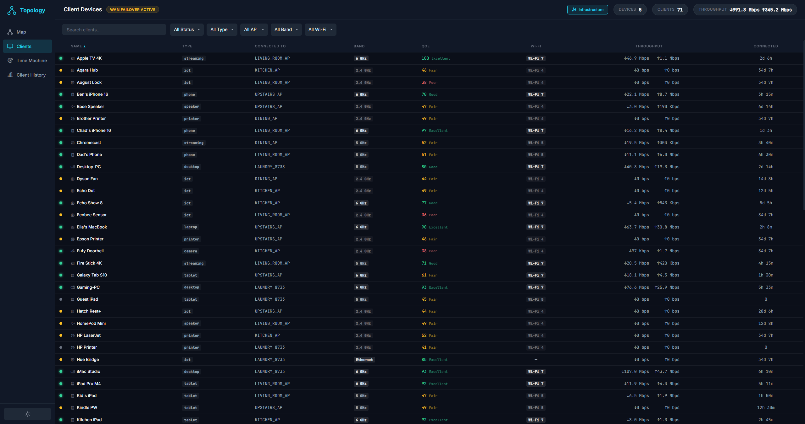
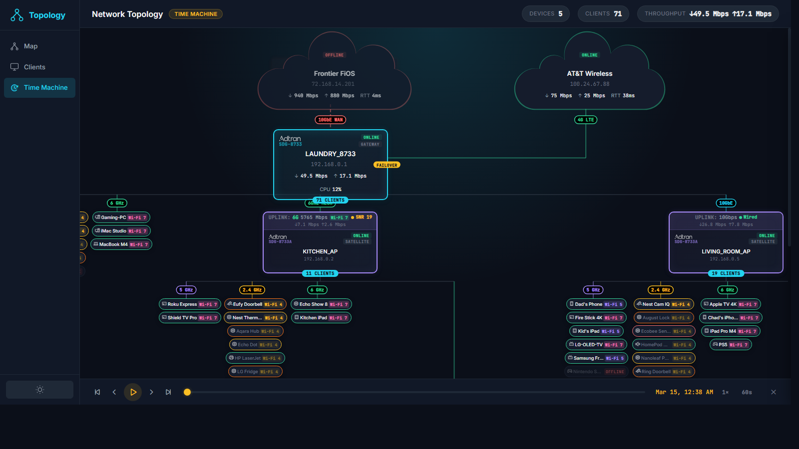
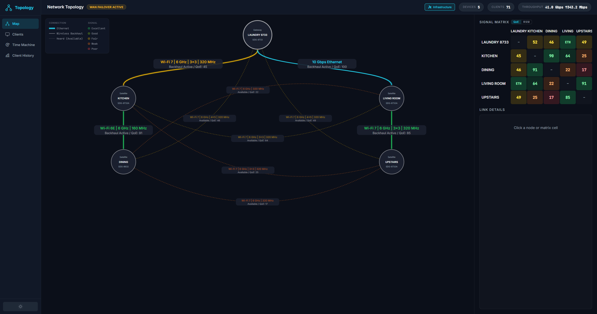

# Intellifi Topology GUI

A real-time network topology visualization for Intellifi SmartOS mesh networks. Displays gateway, satellite, and client devices in an interactive hierarchical map with live throughput, signal quality, and connection status.



## Features

### Topology Map
- **Hierarchical topology map** - Internet, gateway, satellites, and clients rendered as a tree with automatic layout
- **Measure-first layout engine** - DOM elements are measured before positioning, ensuring accurate connection lines with zero gaps
- **Multi-hop mesh support** - Visualizes 3+ hop satellite chains with backhaul quality indicators (speed, SNR, Wi-Fi version)
- **Client band grouping** - Clients organized by radio band (2.4 GHz, 5 GHz, 6 GHz, Ethernet) with colored pills showing RSSI and Wi-Fi generation
- **Three-tier client pill states** - Active (full color), Idle (muted text/badge), Offline (dimmed with red OFFLINE badge) with automatic stacking order
- **Connection integrity checker** - Automated `verifyConnections()` validates every SVG line endpoint connects to a device edge, flags diagonal lines
- **Multi-WAN failover** - Dual internet clouds with primary/backup roles, live failover status badge on the gateway
- **Live animations** - Throughput values pulse with randomized variance, CSS-animated flow lines on active connections
- **QoE history sparklines** - Zone-colored sparklines (green/amber/red) show per-client QoE score over the last hour, with factor heatmaps and interactive hover detail
- **Detail panel** - Click any device or client for expanded stats (interfaces, radios, CPU, memory, temperature, QoE history)
- **Responsive** - Auto-simplifies to compact view when elements would overlap

### Clients Table View



- **Sortable client table** - All clients listed in a sortable table with columns for status, name, type, connected AP, band, QoE score, Wi-Fi generation, throughput, and connected time
- **Color-coded badges** - Type (phone, laptop, IoT, etc.), Band (2.4/5/6 GHz, Ethernet), and Wi-Fi generation badges use the same color palette as the topology map
- **QoE score column** - Per-client QoE score with color coding (green/amber/red) and quality label (Excellent/Good/Fair/Poor)
- **Multi-select filters** - Five checkbox dropdown filters (Status, Type, AP, Band, Wi-Fi) with multi-selection support and one-click Clear
- **Search with autocomplete** - Client search with browser-native autocomplete suggestions populated from all client names
- **Live throughput updates** - Throughput column updates in real-time with fixed-width tabular numerals for stable layout
- **Row click integration** - Click any row to open the same detail panel used in the topology map

### Time Machine



- **Historical playback** - Playback bar for scrubbing through topology snapshots with play/pause, step, and skip controls
- **FLIP animations** - Smooth client/node movement across the map using First-Last-Invert-Play transform transitions
- **Event labels** - Roaming and band-change events shown as pulsing labels that follow elements during animation and freeze on pause
- **Adjustable speed and interval** - 1x/2x/4x playback speed with configurable sample intervals (15s/30s/60s)

### Client Activity History


- **24-hour activity heatmap** - GitHub-contributions-style grid showing per-client WiFi activity across 96 time buckets (15-min intervals), color-coded by QoE score (green/amber/red/gray)
- **Network Pulse header** - Stacked area chart showing total active clients over time, broken down by band (cyan for 6 GHz, purple for 5 GHz, amber for 2.4 GHz)
- **Detail drawer** - Click any client row to expand a bottom panel with four mini charts: QoE sparkline, signal strength, throughput (DL/UL), and retransmission rate
- **Interactive crosshairs** - Hover over any chart for precise time/value readouts using SVG coordinate mapping
- **6 sort modes** - Sort clients by Most Active, Worst QoE, Recently Active, By Band, By Device Type, or Alphabetical via dropdown
- **Band filter** - Filter heatmap rows by radio band (2.4 GHz, 5 GHz, 6 GHz)
- **Real netdata integration** - Fetches live QoE data from SmartOS netdata API (`clientdevice.qoe.*` charts) with automatic client discovery
- **Mock data fallback** - When netdata is unreachable, generates realistic mock data for all 71 clients with deterministic random walks

### Infrastructure Mode



- **D3 hierarchical tree layout** - Gateway at top, satellites positioned below by parent-child backhaul relationships using `d3.tree()` and `d3.linkVertical()` curved connectors
- **Signal quality coloring** - All wireless links colored by RSSI (green/lime/yellow/orange/red scale) with glow layers on active backhaul
- **N x N signal matrix** - Sidebar heatmap grid showing asymmetric RSSI or QoE scores between every node pair, with QoE/RSSI toggle switch
- **Rich hover tooltips** - 4-column table layout showing band, channel width, WiFi version, spatial streams, QoE/RSSI + SNR, channel + noise floor, max PHY rate, current TX/RX PHY rates with MCS indices, and airtime/utilization meter bars
- **Click-to-focus** - Clicking a node highlights its connections and dims all others, suppressing tooltips and clicks on dimmed links
- **Heard (available) links** - Dashed curved arcs between non-parent-child nodes showing passive signal observations, with smart bulge direction (inward for same-tier/skip-tier, outward for adjacent-tier)
- **Link labels** - Two-tier pills on backhaul links (band/streams/channel width + status/QoE) and 75%-size labels on heard arcs
- **Label collision avoidance** - Automatic nudging system prevents label overlap, seeded with node positions
- **Link detail card** - Click any link or matrix cell for expanded forward/reverse RSSI with asymmetry indicator
- **QoE scoring** - Computed from RSSI + SNR for wireless links, displayed on labels and in the signal matrix
- **Model numbers on nodes** - Device model shown below hostname in matching subdued style
- **Auto-open** - `?infra=1` URL parameter opens Infrastructure Mode on page load

### General
- **Dark/light theme** - Toggle between dark and light modes
- **View switching** - Seamless transitions between Map, Clients, Time Machine, and Client History views via sidebar navigation
- **URL parameter support** - Deep-link to views via `?view=clients`, `?view=time-machine`, `?view=client-history`, or `?infra=1`

## Architecture

Single-page app with no build step:

| File | Purpose |
|------|---------|
| `index.html` | Shell markup, sidebar, top bar, SVG canvas, clients table, detail panel |
| `app.js` | Layout engine, connection drawing, animations, view switching, table rendering, Time Machine, Client History, Infrastructure Mode |
| `styles.css` | All styling including dark/light themes, card designs, pill colors, table styles |

### Layout Engine

The layout uses a custom measure-first approach:

1. **Create** all device cards and client pill groups as hidden DOM elements
2. **Measure** actual rendered sizes (wrapper, card, internal offsets)
3. **Compute** positions using a recursive subtree-width algorithm - clients placed left, sub-satellite subtrees placed right
4. **Position** elements and draw SVG connection lines using real coordinates
5. **Verify** connection integrity (every line endpoint must touch a card edge or another line)

No external layout library (dagre, d3-force, etc.) is used. The `LayoutGraph` class provides a simple adjacency list for storing node positions and parent-child edges.

## Running

Serve the directory with any static HTTP server:

```bash
python -m http.server 3457
```

Then open `http://localhost:3457` in a browser.

## Dependencies

- [D3.js v7](https://d3js.org) - Tree layout and SVG rendering for Infrastructure Mode (loaded via CDN)
- [Inter + JetBrains Mono](https://fonts.google.com) - Google Fonts (loaded via CDN)
- [Phosphor Icons](https://phosphoricons.com) - Icon set (loaded via CDN)

No npm, no build tools, no framework.
