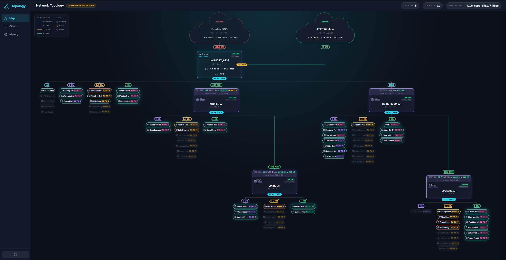

# Intellifi Topology GUI

A real-time network topology visualization for Intellifi SmartOS mesh networks. Displays gateway, satellite, and client devices in an interactive hierarchical map with live throughput, signal quality, and connection status.



## Features

- **Hierarchical topology map** -Internet, gateway, satellites, and clients rendered as a tree with automatic layout
- **Measure-first layout engine** -DOM elements are measured before positioning, ensuring accurate connection lines with zero gaps
- **Multi-hop mesh support** -Visualizes 3+ hop satellite chains with backhaul quality indicators (speed, SNR, Wi-Fi version)
- **Client band grouping** -Clients organized by radio band (2.4 GHz, 5 GHz, 6 GHz, Ethernet) with colored pills showing RSSI and Wi-Fi generation
- **Connection integrity checker** -Automated `verifyConnections()` validates every SVG line endpoint connects to a device edge, flags diagonal lines
- **Live animations** -Throughput values pulse with randomized variance, CSS-animated flow lines on active connections
- **Dark/light theme** -Toggle between dark and light modes
- **Detail panel** -Click any device or client for expanded stats (interfaces, radios, CPU, memory, temperature)
- **Time Machine** -Playback bar for historical topology snapshots
- **Responsive** -Auto-simplifies to compact view when elements would overlap

## Architecture

Single-page app with no build step:

| File | Purpose |
|------|---------|
| `index.html` | Shell markup, sidebar, top bar, SVG canvas, detail panel |
| `app.js` | Layout engine, connection drawing, animations, event handling |
| `styles.css` | All styling including dark/light themes, card designs, pill colors |

### Layout Engine

The layout uses a custom measure-first approach:

1. **Create** all device cards and client pill groups as hidden DOM elements
2. **Measure** actual rendered sizes (wrapper, card, internal offsets)
3. **Compute** positions using a recursive subtree-width algorithm -clients placed left, sub-satellite subtrees placed right
4. **Position** elements and draw SVG connection lines using real coordinates
5. **Verify** connection integrity (every line endpoint must touch a card edge or another line)

No external layout library (dagre, d3-force, etc.) is used. The `LayoutGraph` class provides a simple adjacency list for storing node positions and parent-child edges.

## Running

Serve the directory with any static HTTP server:

```bash
python -m http.server 3457
```

Then open `http://localhost:3457` in a browser.

## Dependencies

- [Inter + JetBrains Mono](https://fonts.google.com) -Google Fonts (loaded via CDN)
- [Phosphor Icons](https://phosphoricons.com) -Icon set (loaded via CDN)

No npm, no build tools, no framework.
